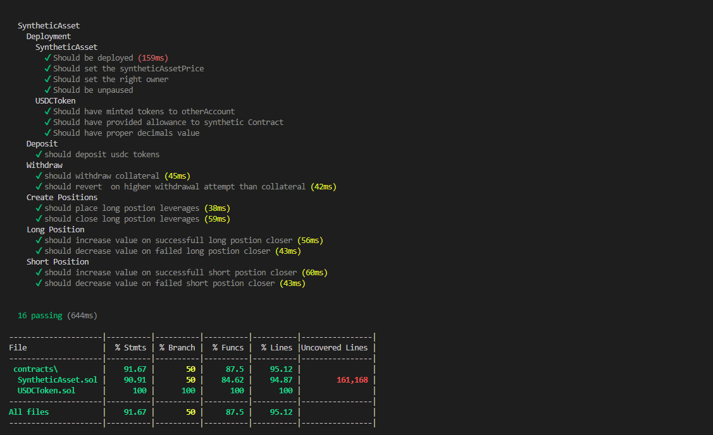
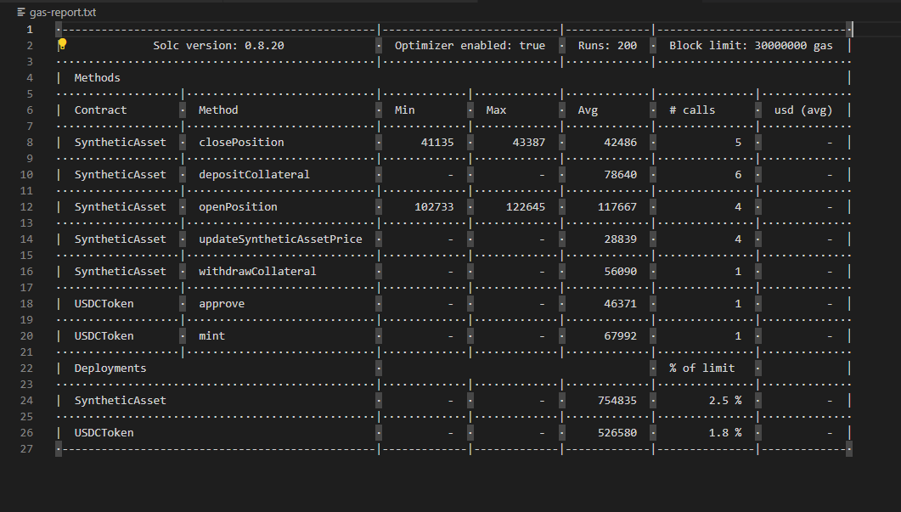

# SyntheticAssetLeverage


## Task Overview:

Your task is to design and implement a smart contract on any EVM network that allows users to deposit collateral (in USDC) and open a leveraged position in a synthetic asset. This assignment will focus on depositing and withdrawing collateral and opening and closing basic leveraged positions without real-time price feeds or liquidation mechanisms.

- Deposit collateral (in a specified ERC-20 token) to open a leveraged position (long or short) in a synthetic asset representing an underlying asset (e.g., ETH/USD).
- Manage their position: increase leverage, reduce leverage, or close the position.

### Key Features to Implement:

- **Collateral Management**: Allow users to deposit and withdraw ERC-20 as collateral.
- **Leveraged Position Management**: Enable users to open and close leveraged positions with the deposited collateral. Assume a fixed price for the synthetic asset for simplicity.
- **Basic Profit/Loss Calculation**: Calculate profit or loss based on a fixed synthetic asset price change upon closing the position. This is to simulate the outcome of a trade without real-time price feeds.

### Expectations:

- **Security**: Implement security best practices to avoid common vulnerabilities.
- **Efficiency**: Aim for gas efficiency in transactions.
- **Testing**: Include basic tests to ensure the contract functions as expected.
- **Documentation**: Provide documentation outlining how to interact with the contract, the assumptions made (e.g., fixed price of the synthetic asset), and a brief explanation of the contract logic.

### Deliverables:

- Solidity smart contract code implementing the above features - with comments to better understand the approach taken
- A set of unit tests for the smart contract


## Usage

### Clone repo
```
git clone https://github.com/THISREPO.git
cd SyntheticAssetLeverage
```
### Download dependencies
```
yarn --frozen-lock-file
OR
npm ci
```
### To compile contracts
```
yarn compile
```
### To run tests
```
yarn test
```
### To deploy contracts to Local Environment
```
yarn local-node

yarn local-deploy
```
### Setup Amoy Testnet Environment

```
npx hardhat vars set POLYGON_TESTNET_RPC_URL

# provide this value as input https://rpc-amoy.polygon.technology
```

```
npx hardhat vars set ADMIN_PRIVATE_KEY

# provide the private key of one of your test account containing some testnet native tokens [DO NOT USE THIS PRIVATE KEY FOR MAINNET]
```
### Deploy to Amoy Testnet

```
yarn deploy-amoy
```


## Test Coverage Report


(Coverage)[gas-report.txt]


## Gas Report



(GasReport)[gas-report.txt]


## Function Docs

(Docs)[docs\SyntheticAsset.md]

